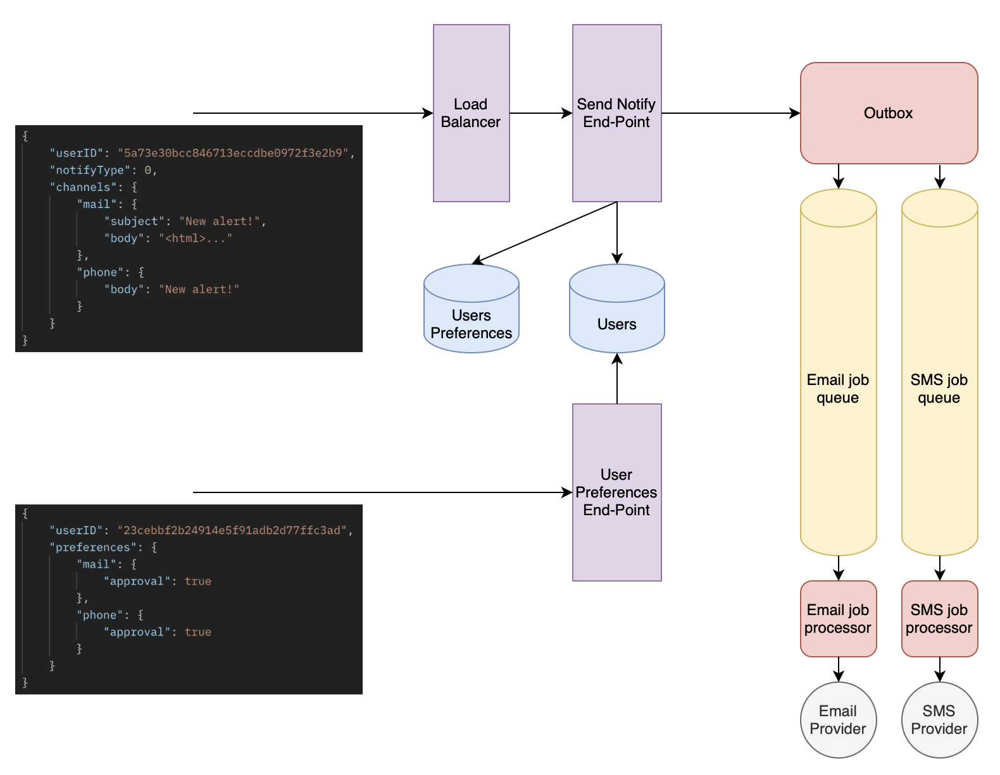

# 📨 Notification Service

[](https://github.com/MovingTowardsADream/Notification-Service/actions/workflows/ci.yml)

[](http://commitizen.github.io/cz-cli/)

A notification service is a software system that manages the sending of notifications across different channels and devices.



## The Launch of
To run an application in a container, you need to configure the command:
```bash
make build
```

## Description of the service
This service is a microservice that is responsible for sending notifications to various channels. 

The service is implemented using a queue - `RabbitMQ` to implement a `Worker Pool` with a guarantee of sending messages. Each channel has its own topic, and within the topic there is a priority of messages. 

Messages are sent using a proprietary SMTP server running with `Postfix`. An external client is used to send SMS messages

## Environment Variables and Configuration
For the application to work correctly, you must specify environment variables in the .env file in the root directory. Below are the variables themselves and a brief description:

`POSTGRES_USER`, `POSTGRES_DB`, `POSTGRES_PASSWORD`, `RABBITMQ_DEFAULT_USER`, `RABBITMQ_DEFAULT_PASS` - parameters for initializing the Postgresql database and RabbitMQ messaging in docker-compose.

`SMTP_DOMAIN`, `SMTP_USERNAME`, `SMTP_PASSWORD` - required parameters for using the SMTP service

`TWILIO_ACCOUNT_SID`, `TWILIO_AUTH_TOKEN`, `TWILIO_MESSAGING_SERVICE_SID` - parameters for the client sending SMS messages

`GF_SECURITY_ADMIN_USER`, `GF_SECURITY_ADMIN_PASSWORD` - parameters for the Grafana

`PG_URL` - link to connect to Postgresql.

`RMQ_URL` - link to the rabbitmq queue.

There is also a `configs` file in which the remaining data is specified.

## The technology stack used
`Golang` `gRPC` `PostgreSQL` `RabbitMQ` 

## Features

- ✅ Using `Event Driven Architecture` on top of RabbitMQ Message Broker
- ✅ Using `Data-Centric Architecture` based on CRUD
- ✅ Using `Event Sourcing` in `Audit Based` services
- ✅ Using `CQRS Pattern` on top
- ✅ Using `gRPC` for internal service communication
- ✅ Using `Postgres` to write databases with fully supported transactions(ACID)
- ✅ Using `OpenTelemetry` for collection `Distributed Tracing` with using Grafana
- ✅ Using `Prometheus` for collection `Metrics` with using Grafana
- ✅ Using `Unit Test` for testing small units with mocking dependent classes
- ✅ Using `End2End Test` and `Integration Test` for testing features with all of their real dependencies using docker containers (cleanup tests) and testcontainers-go library
- ✅ Using `docker` and `docker-compose` for deployment
- ✅ Using `Domain Driven Design` in some of the services
- ✅ Using `Helm` and `Kubernetes` for deployment
- ✅ Using `Outbox Pattern` to guarantee sending
