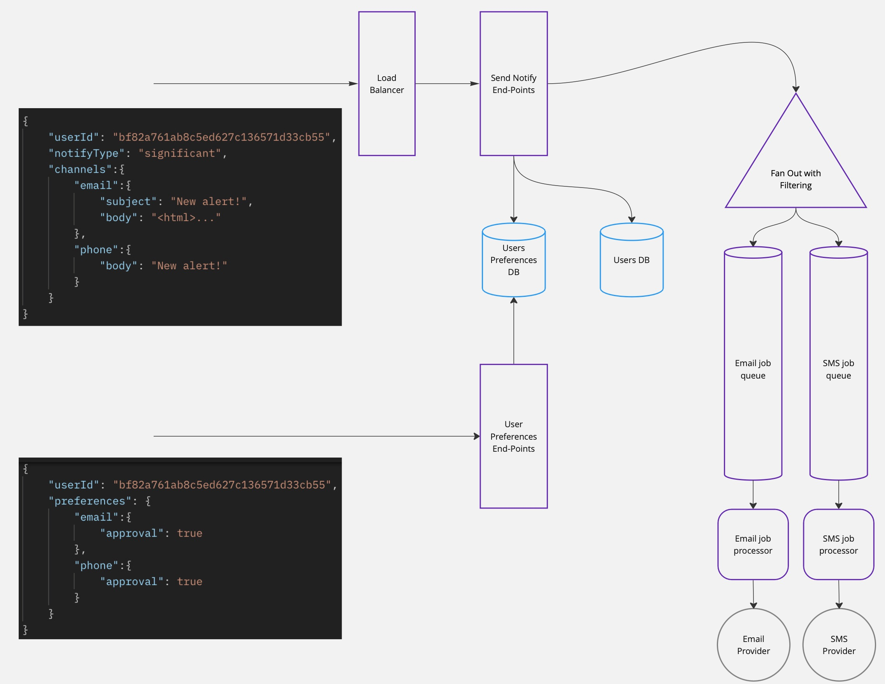

# Notification Service

A notification service is a software system that manages the sending of notifications across different channels and devices.



## The Launch of
To run an application in a container, you need to configure the command:
```bash
make build
```

## Description of the service
This service is a microservice that is responsible for sending notifications to various channels. 

The service is implemented using a queue - `RabbitMQ` to implement a `Worker Pool` with a guarantee of sending messages. Each channel has its own topic, and within the topic there is a priority of messages. 

Messages are sent using a proprietary SMTP server running with `Postfix`.

## Environment Variables and Configuration
For the application to work correctly, you must specify environment variables in the .env file in the root directory. Below are the variables themselves and a brief description:
`GIN_MODE` - set to debug mode if debugging is necessary.

`POSTGRES_USER`, `POSTGRES_DB`, `POSTGRES_HOST`, `POSTGRES_PORT`, `POSTGRES_PASSWORD` - parameters for initializing the Postgresql database in docker-compose.

`SMTP_DOMAIN`, `SMTP_PORT`, `SMTP_USERNAME`, `SMTP_PASSWORD`, `MAIL` - required parameters for using the SMTP service

`PG_URL` - link to connect to Postgresql.

`RMQ_URL` - link to the rabbitmq queue.

There is also a config.yaml file in which the remaining data is specified.

## The technology stack used
`Golang` `PostgreSQL` `gRPC` `RabbitMQ` 
